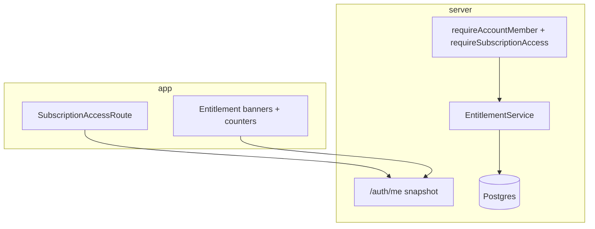

# Architecture Spine — subscription-entitlements

## Design Paradigm

**Layered guards** on the existing NestJS + Postgres brownfield stack:

1. **Membership** — account member (unchanged).
2. **Access gate** — time-bounded subscription (`hasAccess`); blocks all module/team mutations and public widget runtime when false.
3. **Entitlement gate** — numeric quotas per effective plan tier when `hasAccess` is true.
4. **Compliance mode** — when persisted data exceeds current tier limits, block runtime/actions until compliant; removal paths stay available.

Pure entitlement math lives in `server/src/subscriptions/` (no HTTP). **Rollout phase 1:** evaluate on module **GET** (page load payloads), not on `/auth/me` alone; **no INSERT guards yet**. Phase 2 (deferred): assert before commits in DB mutators.



## Invariants & Rules

### AD-1 — Two-layer subscription model [ADOPTED]

- **Binds:** subscription-access, all module write APIs, kick-chat handlers, public widget reads
- **Prevents:** mixing “expired account” with “active but over quota” or duplicating plan logic in React
- **Rule:** **`hasAccess`** (time + `account_subscriptions.status`) is evaluated first. If false, reject with `SUBSCRIPTION_EXPIRED` / `subscription_expired` and do not evaluate quotas. If true, resolve **effective tier** (`trial` | `pro` | `max`) and apply entitlements.

### AD-2 — Effective tier resolution [ADOPTED]

- **Binds:** auth snapshot, internal admin updates, catalog UI, `account_subscriptions.plan_tier`
- **Prevents:** drift between `plan_tier`, `kind`, and display fields
- **Rule:** **`account_subscriptions.plan_tier`** is the canonical entitlement id: **`trial` | `pro` | `max`** (migrate legacy `full` / **`studio` → `max`**). Single function `resolveEffectivePlanTier(subscriptionRow)`:
  - `!hasAccess` → no tier (entitlements N/A).
  - Active row → entitlements from **`plan_tier`** (admin and auto-provision must set `plan_tier` correctly for trial on create).
  - `accounts.subscription_plan` remains display/admin mirror only; do not derive limits from it.
  - Expired/revoked: `hasAccess: false`; not a separate entitlement tier.

### AD-3 — Entitlement matrix is code-owned constants [ADOPTED]

- **Binds:** server enforcement, `/auth/me`, subscription catalog
- **Prevents:** per-module magic numbers and inconsistent limits
- **Rule:** One table `PLAN_ENTITLEMENTS` in `server/src/subscriptions/plan-entitlements.ts`:

| Tier | nonArchivedSessionsPerModule | prizeSpinSectorsPerSession | bonusBuySlotsPerSession | adminMembers |
| --- | --- | --- | --- | --- |
| trial | 2 | 10 | 20 | 1 |
| pro | 5 | 20 | 40 | 2 |
| max | null (unlimited) | null | null | null |

Trial duration remains **`TRIAL_DURATION_DAYS = 3`** from account creation (existing provision path). Auto trial on account create; platform admin changes plan/end date only.

### AD-4 — Counting semantics [ADOPTED]

- **Binds:** bonus-buy, prize-spin, chat-roll, team
- **Prevents:** archive/delete bypass and ambiguous “session” limits
- **Rule:**
  - **Sessions per module:** count rows where session status **≠ archived** (module-specific status enum); archived sessions unlimited.
  - **Copy session:** creates a new non-archived session → subject to session cap (reject if at cap).
  - **Prize spin sectors:** count per **prize_spin_id** (session), not account-wide.
  - **Bonus buy slots:** count non-archived slots per **bonus_buy_id**; archiving a slot frees quota.
  - **Moderators:** count memberships with **`role === 'admin'`**; owner excluded.

### AD-5 — Enforcement rollout (GET first, INSERT deferred) [ADOPTED]

- **Binds:** module list/detail GET handlers, session page payloads; later POST/INSERT paths
- **Prevents:** duplicating checks only in `/auth/me` or only in React
- **Rule (phase 1):** On **module page GET** (e.g. session detail, module home), attach **`entitlements`** + **`usage`** + **`compliance`** to the response; UI disables create/actions at cap. **Do not** add INSERT/assert guards on create/copy/sector/slot yet — tracked as phase 2 in Deferred.
- **Rule (phase 2):** Before INSERT or usage increase, `assertEntitlement` → **`403`** `{ code: 'ENTITLEMENT_LIMIT', ... }`.

### AD-6 — Over-limit compliance mode [ADOPTED]

- **Binds:** module session GET payloads, delete/archive mutations + follow-up refetch, UI
- **Prevents:** silent broken state after downgrade; forcing manual full page reload
- **Rule:** On **session page GET**, compute **`compliance: 'ok' | 'over_limit'`** from `plan_tier` limits vs persisted counts. When `over_limit`, UI blocks interaction except delete/archive.
- **After removal:** on each successful delete/archive, client **refetches the same session GET** (e.g. React Query invalidate/refetch). Do **not** rely on a full page reload; do **not** require compliance fields on the delete response body (refetch is the single source of truth). User regains interaction as soon as refetched `compliance === 'ok'`.
- Phase 2 (deferred): server **`ENTITLEMENT_OVER_LIMIT`** on go-live/spin/intake when still over limit.

### AD-7 — Entitlements on module GET (not login-only) [ADOPTED]

- **Binds:** module list/detail API responses, session pages, dashboard admin banner
- **Prevents:** stale limits when `/auth/me` is not re-fetched; over-reliance on client-only gating
- **Rule:** **`/auth/me`** keeps **`hasAccess`**, **`plan_tier`**, **`endsAt`** (light). Full **`entitlements` + `usage` + `compliance`** ship on **module GET** payloads used by pages. Server computes; client does not re-derive tier. Optional: mirror summary on `/auth/me` later — not required for phase 1.

### AD-8 — Expired subscription UX [ADOPTED]

- **Binds:** app router, dashboard, public widgets, kick-chat
- **Prevents:** moderators stuck without explanation; live overlay when account has no access
- **Rule:** Unchanged routing: modules/team behind `SubscriptionAccessRoute`. Owner retains `/subscription`. **Admin** (non-owner) sees dashboard banner: «Подписка команды не активна — свяжитесь с владельцем аккаунта». When **`!hasAccess`**: public widget GET returns **`unavailable`** + **`subscription_expired`**; kick handlers ignore with same reason. OBS shows i18n via `publicWidgetUnavailableMessage`.

### AD-10 — Public widgets and over-limit [ADOPTED]

- **Binds:** `getPublicBonusBuyWidgetByUcid`, `getPublicPrizeSpinWidgetByUcid`, `getPublicChatRollWidgetByUcid`, `public-widget.ts` reasons/copy
- **Prevents:** OBS keeps running while app is in compliance lockout after downgrade
- **Rule:** After `hasAccess` check, run the **same compliance evaluation** as module session GET (shared helper). If **`over_limit`** → **`unavailable`** + reason **`entitlement_over_limit`** (distinct copy from subscription expired). When user fixes data in app, next widget poll/refetch returns **`active`** without OBS browser reload. Phase 2 may add hard block on spin/intake POST; phase 1 uses public GET gate only.

### AD-9 — Plan changes via platform admin only [ADOPTED]

- **Binds:** internal-subscriptions service, `accounts.subscription_plan`, `account_subscriptions`
- **Prevents:** split brain between admin UI and auto-provision
- **Rule:** Keep **`applySubscriptionAdminUpdate`** as sole writer of plan transitions (trial / paid pro|max / revoked). Rename **`paidPlan: 'studio'` → `'max'`**. Sync `accounts.subscription_plan` to `trial` (optional display), `pro`, `max`, or `free` when revoked/expired. Audit log unchanged (`subscription_admin_events`).

## Consistency Conventions

| Concern | Convention |
| --- | --- |
| Error codes | `SUBSCRIPTION_EXPIRED` (no access); `ENTITLEMENT_LIMIT` (at cap); `ENTITLEMENT_OVER_LIMIT` (compliance); public widget reasons: `subscription_expired`, `entitlement_over_limit` |
| Module ids | `bonus_buy`, `prize_spin`, `chat_roll` — keys for session counts |
| Tier ids | `trial`, `pro`, `max` — lowercase everywhere |
| Unlimited | `null` in matrix; never use `-1` or `Infinity` in API JSON |
| Enforcement location | Phase 1: auth.service GET formatters; Phase 2: shared assert in DB mutators |

## Stack

| Name | Version |
| --- | --- |
| Node / NestJS | brownfield (existing) |
| PostgreSQL | brownfield (existing) |
| React app | brownfield (existing) |

## Structural Seed

```text
server/src/subscriptions/
  account-subscription-access.ts      # existing hasAccess
  account-subscription.constants.ts   # TRIAL_DURATION_DAYS
  plan-entitlements.ts                # AD-3 matrix
  resolve-effective-plan.ts           # AD-2
  entitlement-usage.ts                # AD-4 queries (counts)
  entitlement-guard.ts                # AD-5, AD-6 assert*
  subscription-compliance.service.ts  # optional facade for auth snapshot

server/src/internal-admin/
  internal-subscriptions.service.ts   # AD-9 paidPlan max

app/src/lib/
  subscription-catalog.ts             # trial/pro/max/expired
  account-subscription.ts             # consume snapshot fields
```

## Capability → Architecture Map

| Capability / Area | Lives in | Governed by |
| --- | --- | --- |
| Time access | `account-subscription-access`, DB snapshot | AD-1, AD-8 |
| Tier + limits | `plan-entitlements`, `resolve-effective-plan` | AD-2, AD-3 |
| Session create/copy | DB create paths per module | AD-4, AD-5 |
| Sectors / slots | prize-spin / bonus-buy DB | AD-4, AD-5, AD-6 |
| Team admins | membership invite/role | AD-4, AD-5 |
| Kick chat / widgets | auth.service public paths, kick handlers | AD-1, AD-6, AD-8, AD-10 |
| Admin plan CRUD | internal-subscriptions | AD-9 |
| UI gating | `ProtectedRoute`, module pages | AD-7, AD-8 |

## Deferred

- **Phase 2 — INSERT/assert guards** on create/copy/sector/slot/invite (API hard enforcement).
- **Phase 2 — `ENTITLEMENT_OVER_LIMIT`** on go-live, spin, kick intake, public widget when over limit.
- Automated billing / Stripe — manual admin only by product choice.
- Per-dimension soft warnings at 80% usage — UX polish after hard gates ship.
- DB CHECK on `plan_tier` enum (`trial`|`pro`|`max`) after data migration.
- Exact list of “removal-only” operations per module — story-level spec tied to AD-6.
