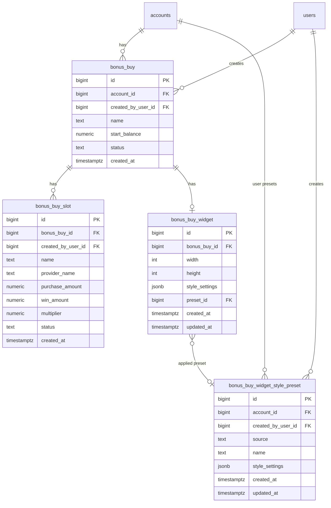

# Bonus Buy — database schema (v2)

Target persistence layer after schema rework. Supersedes column-level definitions in `bonus-buy-records.md`, `bonus-buy-slots.md`, and account-scoped `bonus-buy-widget.md`.

## Entity overview



## `bonus_buy`

Session record — one bonus buy run per row.

| Column | Type | Default | Notes |
|--------|------|---------|-------|
| `id` | `BIGSERIAL PRIMARY KEY` | | |
| `account_id` | `BIGINT NOT NULL REFERENCES accounts(id) ON DELETE CASCADE` | | Tenant scope |
| `created_by_user_id` | `BIGINT NOT NULL REFERENCES users(id)` | | Operator at insert |
| `name` | `TEXT NOT NULL` | | Operator label (was `title`) |
| `start_balance` | `NUMERIC(12, 2) NOT NULL` | | USD with cents |
| `status` | `TEXT NOT NULL` | `'active'` | `active` \| `archived` |
| `created_at` | `TIMESTAMPTZ NOT NULL` | `now()` | |

**Status semantics:**

| Value | Meaning |
|-------|---------|
| `active` | Visible in default history list; session workspace available |
| `archived` | Soft-closed; excluded from default list |

**Indexes:**

```sql
CREATE INDEX idx_bonus_buy_account_created
  ON bonus_buy (account_id, created_at DESC)
  WHERE status != 'archived';
```

**Migration from v1:**

```sql
-- title → name, is_active → status
UPDATE bonus_buy SET status = CASE WHEN is_active THEN 'active' ELSE 'archived' END;
```

Multiple `active` rows per account remain allowed (same as v1 `is_active = true`).

## `bonus_buy_slot`

Slot entries under one session.

| Column | Type | Default | Notes |
|--------|------|---------|-------|
| `id` | `BIGSERIAL PRIMARY KEY` | | |
| `bonus_buy_id` | `BIGINT NOT NULL REFERENCES bonus_buy(id) ON DELETE CASCADE` | | |
| `created_by_user_id` | `BIGINT NOT NULL REFERENCES users(id)` | | |
| `name` | `TEXT NOT NULL` | | Slot title (was `slot_name`) |
| `provider_name` | `TEXT` | | Optional nick/provider (was `nick_provider`) |
| `purchase_amount` | `NUMERIC(12, 2) NOT NULL` | | USD; > 0 |
| `win_amount` | `NUMERIC(12, 2)` | | Nullable until result |
| `multiplier` | `NUMERIC(10, 2)` | | Server-derived from win ÷ purchase |
| `status` | `TEXT NOT NULL` | `'pending'` | `pending` \| `playing` \| `archived` |
| `created_at` | `TIMESTAMPTZ NOT NULL` | `now()` | |

**Status semantics** (replaces `is_now_playing` + `is_archived`):

| Value | Meaning | v1 equivalent |
|-------|---------|---------------|
| `pending` | Active in list/stats; not on widget | `is_archived=false`, `is_now_playing=false` |
| `playing` | Currently shown on stream widget | `is_archived=false`, `is_now_playing=true` |
| `archived` | Soft-deleted; excluded from list/stats | `is_archived=true` |

**Win state** remains inferred from `win_amount` (null = pending result) — orthogonal to slot `status`.

**Constraints:**

```sql
ALTER TABLE bonus_buy_slot
  ADD CONSTRAINT chk_bonus_buy_slot_status
  CHECK (status IN ('pending', 'playing', 'archived'));

CREATE UNIQUE INDEX idx_bonus_buy_slot_one_playing
  ON bonus_buy_slot (bonus_buy_id)
  WHERE status = 'playing';

CREATE INDEX idx_bonus_buy_slot_list
  ON bonus_buy_slot (bonus_buy_id, created_at ASC)
  WHERE status != 'archived';
```

**State transitions:**

| Action | Transition |
|--------|------------|
| Create slot | `pending` |
| Set as playing | siblings `playing` → `pending`; target → `playing` (one transaction) |
| Clear playing | `playing` → `pending` |
| Delete (archive) | any → `archived` |

**Migration from v1:**

```sql
UPDATE bonus_buy_slot SET status = CASE
  WHEN is_archived THEN 'archived'
  WHEN is_now_playing THEN 'playing'
  ELSE 'pending'
END;
```

## `bonus_buy_widget`

Per-session overlay configuration — **one row per `bonus_buy`**, not per account.

| Column | Type | Default | Notes |
|--------|------|---------|-------|
| `id` | `BIGSERIAL PRIMARY KEY` | | |
| `bonus_buy_id` | `BIGSERIAL NOT NULL UNIQUE REFERENCES bonus_buy(id) ON DELETE CASCADE` | | One widget row per session |
| `width` | `INTEGER NOT NULL` | `500` | px; 200–2400 |
| `height` | `INTEGER NOT NULL` | `600` | px; 200–2400 |
| `preset_id` | `BIGINT NOT NULL REFERENCES bonus_buy_widget_style_preset(id)` | | Applied theme; styles resolved via JOIN |
| `created_at` | `TIMESTAMPTZ NOT NULL` | `now()` | |
| `updated_at` | `TIMESTAMPTZ NOT NULL` | `now()` | |

**Style resolution:** widget row stores no style columns. API and overlay JOIN `bonus_buy_widget_style_preset` on `preset_id` and return `style_settings` from the preset row.

**Bootstrap** (`ON CONFLICT (bonus_buy_id) DO NOTHING`):

1. Same transaction as `INSERT INTO bonus_buy` on session create.
2. Resolve preset: account **user** custom preset if present; else first **system** preset (`ORDER BY id ASC`).
3. Insert widget row with `preset_id` only (no style snapshot).
4. Lazy fallback on `GET .../bonus-buys/:id/widget` for legacy rows.

**Archived session overlay:** public `GET /bonus-buys/:id/widget` returns `409 SESSION_ARCHIVED` — client shows inactive message and does not load slot/widget data.

**Supersedes:** account-scoped `bonus_buy_widget.account_id UNIQUE` (v23 decision).

## `bonus_buy_widget_style_preset`

Named style templates — system catalog + **at most one** custom preset per account.

| Column | Type | Default | Notes |
|--------|------|---------|-------|
| `id` | `BIGSERIAL PRIMARY KEY` | | |
| `account_id` | `BIGINT REFERENCES accounts(id) ON DELETE CASCADE` | | `NULL` for system presets |
| `created_by_user_id` | `BIGINT REFERENCES users(id)` | | `NULL` for system presets |
| `source` | `TEXT NOT NULL` | | `system` \| `user` |
| `name` | `TEXT NOT NULL` | | System: catalog id (`main`, `classic`, …). User: always `'Custom'` (server-set, not editable) |
| `style_settings` | `JSONB NOT NULL` | | Same shape as widget `style_settings` (colors + shape + font; no width/height) |
| `created_at` | `TIMESTAMPTZ NOT NULL` | `now()` | |
| `updated_at` | `TIMESTAMPTZ NOT NULL` | `now()` | |

**Source rules:**

| `source` | `account_id` | `created_by_user_id` | CRUD |
|----------|--------------|----------------------|------|
| `system` | `NULL` | `NULL` | Seed only; not editable via API |
| `user` | required | required | **One row per account** — upsert on save; members update/delete the account custom preset |

**Constraints:**

```sql
ALTER TABLE bonus_buy_widget_style_preset
  ADD CONSTRAINT chk_bonus_buy_widget_style_preset_source
  CHECK (source IN ('system', 'user'));

ALTER TABLE bonus_buy_widget_style_preset
  ADD CONSTRAINT chk_bonus_buy_widget_style_preset_source_account
  CHECK (
    (source = 'system' AND account_id IS NULL AND created_by_user_id IS NULL)
    OR (source = 'user' AND account_id IS NOT NULL AND created_by_user_id IS NOT NULL)
  );

CREATE UNIQUE INDEX idx_bonus_buy_widget_style_preset_system_name
  ON bonus_buy_widget_style_preset (name)
  WHERE source = 'system';

CREATE UNIQUE INDEX idx_bonus_buy_widget_style_preset_account_user
  ON bonus_buy_widget_style_preset (account_id)
  WHERE source = 'user';
```

**System seed:** eight presets from `widget-theme-presets.md` (`main`, `classic`, `ruby`, `scarlet`, `purple`, `electric_blue`, `midnight`, `neon`) inserted in `initSchema()` via `bonus-buy-widget-defaults.ts`.

**Preset vs widget storage:**

- Preset row = canonical style template (colors/shape/font only).
- Widget row = session overlay config (`width`, `height`, `preset_id` only).
- Applying a preset sets `preset_id`; styles are read from the preset via JOIN.
- **User-authored styles** live only in the account's single `source='user'` preset.

**Custom preset (one per account):**

| Concern | Rule |
|---------|------|
| Cardinality | At most one `source='user'` row per `account_id` (unique partial index) |
| Display name | UI always shows **Custom** — ignore `name` from API for `source='user'` |
| Create | First save of a non-system theme → `INSERT`; subsequent saves → `UPDATE` same row (upsert) |
| Delete | Optional `DELETE` removes custom row; widgets with that `preset_id` get `SET NULL` |
| Picker order | System presets first, **Custom** chip last (only when row exists) |
| Bootstrap | On new session, if account custom preset exists → copy it; else first system preset |

## API surface changes

| Concern | v1 | v2 |
|---------|----|----|
| Record field | `title`, `isActive` | `name`, `status` |
| Slot field | `slotName`, `nickProvider`, `isNowPlaying` | `name`, `providerName`, `status` |
| Archive session | `PATCH is_active=false` (implicit) | `PATCH status='archived'` |
| Set playing | `PATCH is_now_playing: true` | `PATCH status: 'playing'` |
| Widget read (auth) | `GET /accounts/:accountId/bonus-buy-widget` | `GET /accounts/:accountId/bonus-buys/:bonusBuyId/widget` |
| Widget write | `PATCH /accounts/:accountId/bonus-buy-widget` | `PATCH /accounts/:accountId/bonus-buys/:bonusBuyId/widget` |
| Public overlay | `GET /bonus-buys/:id/widget` | unchanged path; resolve widget by `bonus_buy_id` directly |
| Presets list | client constants only | `GET /accounts/:accountId/bonus-buy-widget-presets` |
| User preset CRUD | — | `POST/PATCH/DELETE .../bonus-buy-widget-presets/:presetId` |

Public overlay response unchanged in shape — `settings` now comes from session widget row.

## Design rationale

| Concern | Decision | Why |
|---------|----------|-----|
| Session `status` vs boolean | `active` / `archived` | Aligns with `chat_roll.status`; room for future states without new columns |
| Slot `status` enum | `pending` / `playing` / `archived` | One column replaces two booleans; playing is explicit domain state, not a flag combo |
| Widget FK | `bonus_buy_id` UNIQUE | Each session can have distinct overlay styling; matches original CAP-19 before v23 pivot |
| Style columns → JSONB | `style_settings` on widget + preset | Adding theme tokens no longer requires migrations; presets and widget share one validator |
| Width/height columns | Keep on widget, not in preset JSON | OBS dimensions are session overlay config; presets are color/theme templates only |
| Presets in DB | `bonus_buy_widget_style_preset` | Enables user-defined themes and single source for system catalog; replaces client-only constants |
| `source` column | `system` \| `user` | Explicit provenance; guards CRUD and NULL FK rules |

## Migration strategy

**Greenfield / dev (`initSchema` drops tables):** replace DDL in `DatabaseService.initSchema()` — no ALTER migration needed.

**Production (if data exists):**

1. Add new columns / tables alongside v1.
2. Backfill `name`, `status`, slot renames, widget per-session rows (copy account widget to each active session).
3. Seed system presets.
4. Switch application reads/writes.
5. Drop deprecated columns (`title`, `is_active`, `is_now_playing`, `is_archived`, flat color columns, `account_id` on widget).

## Out of scope (this schema slice)

- Copy widget settings from previous session on create (recommended bootstrap behavior — implement in service layer)
- Preset preview thumbnails / `previewDots` (UI concern; derive from `style_settings` client-side)
- Archiving a `bonus_buy` session cascades widget read-only behavior (product rule — not enforced in DDL)
