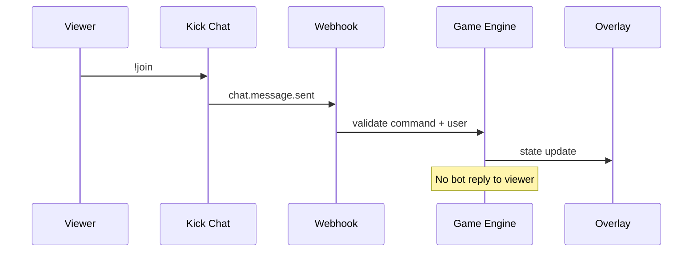
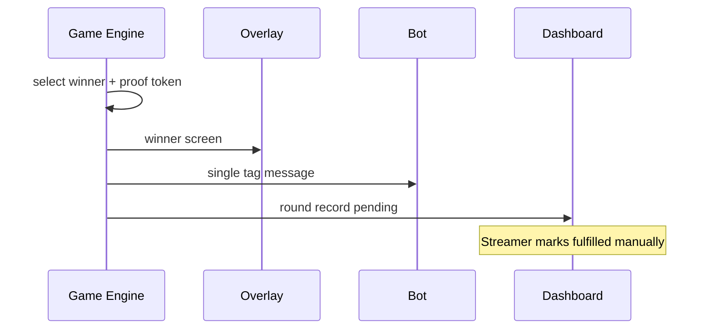

# Architecture Flows

High-level flows for implementers. Detailed stack choices belong in a separate architecture spec.

## Component boundaries

| Component | Role |
|-----------|------|
| Kick webhook receiver | Ingest `chat.message.sent`, parse commands |
| Game engine | State machine per active round per channel |
| RNG service | Seeded random selection with audit log |
| Overlay client | Browser source; WebSocket or SSE from platform |
| Streamer dashboard | Configure games, launch/end rounds, fulfillment |
| Chat bot | Post winner message via `POST /public/v1/chat` |

## Command intake flow

## Round completion flow

## Kick API surface (MVP)

| Need | Official API |
|------|----------------|
| Receive commands | Webhook `chat.message.sent` |
| Announce winner | `POST /public/v1/chat` (bot) |
| Streamer OAuth | `events:subscribe`, `chat:write` |
| Optional mod sync | `moderation.banned` webhook |

**Not used in MVP:** watchtime, viewer list, `active-chatters`, channel points redemption webhooks, `kicks.gifted`, subscription gift events.

## Overlay requirements

- Dark casino aesthetic consistent with CasinoStream brand (gold accents).
- Readable at 1080p stream overlay scale.
- States: idle, lobby/countdown, active, winner reveal.
- Marathon: persistent strip between flashes + full-screen flash state.

## Data retained per round

- `channel_id`, `game_id`, `settings_snapshot`
- `participants[]` with user_id, commands, timestamps
- `winner_user_id`, `proof_token`, `rng_seed` (if applicable)
- `fulfillment_status`, `fulfilled_at`
