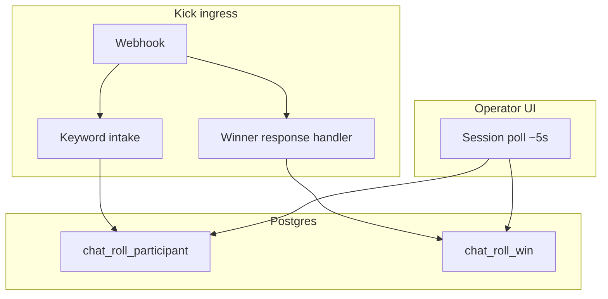

# Chat Roll — live intake & winner response (architecture spine)

## Inherited invariants

- **AD-1–AD-4** from [spec-kick-chat-bot/ARCHITECTURE-SPINE.md](../spec-kick-chat-bot/ARCHITECTURE-SPINE.md) — single webhook, keyword intake, session flags, mock dev transport.
- Participant dedup: one active row per `(chat_roll_id, provider, provider_user_id)` when `is_archived = false`.

## Paradigm

Webhook-driven chat actions + **HTTP polling** on the operator dashboard. No third-party realtime bus. Win rows carry their own **post-roll response** lifecycle independent of other wins.

## AD-5 — Dashboard sync without push

- **Binds:** While `chat_roll.status = 'live'`, the session query polls every ~5s (same pattern as Bonus Buy / Prize Spin widget polling).
- **Prevents:** Pusher, SSE, or WebSocket for participant/win lists in this slice.
- **Rule:** Polling stops when session is `off_air` or `archived`.

## AD-6 — Intake-only chat persistence

- **Binds:** No full chat log; no operator “add from chat” API or UI.
- **Prevents:** `kick_chat_events` rows for every message; sender snapshot tables for picker UI.
- **Rule:** Keyword path uses existing participant insert + dedup; optional `message_id` dedup only to idempotize webhook redelivery on handled paths (see kick-chat-bot AD-1). Do not persist keyword attempts per user as a message history.

## AD-7 — Participant dedup and re-entry

- **Binds:** Repeat keyword from the same Kick user while still in the active pool → `duplicate`, no bot join reply.
- **Prevents:** Multiple active participant rows for one platform user per session.
- **Rule:** After operator archives a participant, the same `provider_user_id` may keyword-join again → new active row.

## AD-8 — Winner response window (per win)

- **Binds:** Session settings `winner_response_enabled` and `winner_response_seconds` (copied on create like other roll settings).
- **Prevents:** Blocking **Roll** until pending responses complete; a single global pending gate on the session.
- **Rule:** Each `chat_roll_win` has its own `response_status` and deadline. Multiple wins may be `pending` at once; **Roll** remains available whenever eligible participants exist.

### Response statuses

| Status | Meaning |
|--------|---------|
| `not_required` | Feature off at pick time |
| `pending` | Awaiting any non-empty chat message from winner before `response_deadline_at` |
| `confirmed` | Winner sent qualifying chat in time |
| `no_response` | Deadline passed without qualifying chat |

### Matching chat to win

- On `chat.message.sent`, after routing to the account’s **live** session, if `winner_response_enabled`: match `sender.user_id` to `chat_roll_participant.provider_user_id` for wins in `pending` with `now() < response_deadline_at`.
- **Qualifying message:** trimmed `content` non-empty (not keyword-specific).
- **FIFO:** If the same user has multiple `pending` wins, one message confirms the **oldest** pending win only (`created_at ASC`).
- Messages before pick time do not count. Pause entries does not block claim handling.

### Expiry

- **Lazy expiry:** On session GET / list wins, set `no_response` where `pending` and `response_deadline_at < now()`.
- No auto re-roll on `no_response`; operator may roll again manually.

## Component map

## Deferred

- Pusher / SSE for sub-second multi-moderator sync
- Operator manual add from chat
- Auto re-roll when `no_response`
- Public overlay showing response status
- TTL job for `kick_chat_events` (if table kept for dedup only)
