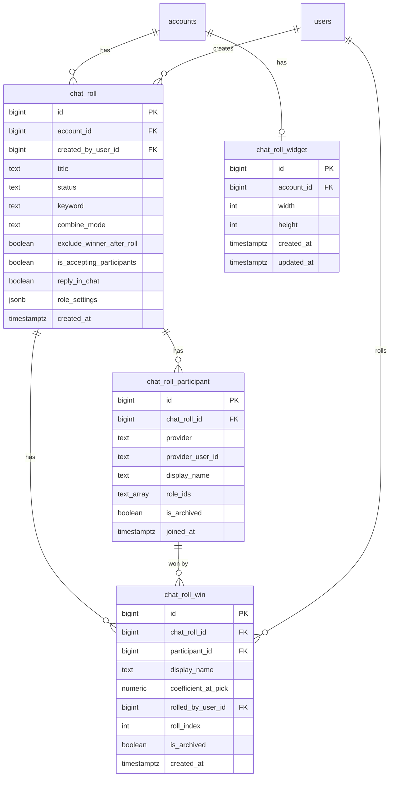

# Chat Roll — database schema

Persistence layer for Chat Roll sessions, modeled after Prize Spin (`prize_spin`, `prize_spin_win`, `prize_spin_widget`). Child tables hold participants and winners; roll settings are a **session snapshot** on `chat_roll`.

## Entity overview



## `chat_roll`

Session record — mirrors `prize_spin`.

| Column | Type | Default | Notes |
|--------|------|---------|-------|
| `id` | `BIGSERIAL PRIMARY KEY` | | |
| `account_id` | `BIGINT NOT NULL REFERENCES accounts(id) ON DELETE CASCADE` | | |
| `created_by_user_id` | `BIGINT NOT NULL REFERENCES users(id)` | | Caz Agent operator |
| `title` | `TEXT NOT NULL` | | Operator label; default from keyword on create |
| `status` | `TEXT NOT NULL` | `'off_air'` | `live` \| `off_air` \| `archived` |
| `keyword` | `TEXT NOT NULL` | `'!roll'` | Trimmed, 1–32 chars |
| `combine_mode` | `TEXT NOT NULL` | `'highest'` | `highest` \| `sum` |
| `exclude_winner_after_roll` | `BOOLEAN NOT NULL` | `true` | When true, picked participant is soft-removed from pool |
| `is_accepting_participants` | `BOOLEAN NOT NULL` | `true` | When false, reject all new participant inserts; Roll and existing pool unchanged |
| `reply_in_chat` | `BOOLEAN NOT NULL` | `false` | When true, Kick bot posts a join confirmation in chat after a successful keyword match |
| `role_settings` | `JSONB NOT NULL` | see below | Session snapshot of five role toggles + weights |
| `created_at` | `TIMESTAMPTZ NOT NULL` | `now()` | |

**Indexes:**

```sql
CREATE INDEX idx_chat_roll_account_created
  ON chat_roll (account_id, created_at DESC)
  WHERE status != 'archived';

CREATE UNIQUE INDEX idx_chat_roll_account_live
  ON chat_roll (account_id)
  WHERE status = 'live';
```

**`role_settings` JSON shape** (validated server-side):

```json
{
  "moderator":         { "enabled": false, "weight": 1 },
  "vip":               { "enabled": true,  "weight": 2 },
  "og":                { "enabled": false, "weight": 1.5 },
  "channel_follower":  { "enabled": false, "weight": 1 },
  "paid_subscriber":   { "enabled": true,  "weight": 2 }
}
```

Validation: all five keys required; `weight` ∈ [0.1, 100] one decimal; at least one `enabled: true`.

**Settings copy on create:** new session copies `keyword`, `combine_mode`, `exclude_winner_after_roll`, `role_settings`, `is_accepting_participants`, and `reply_in_chat` from the account's most recent non-archived session; falls back to app defaults when none exists (`is_accepting_participants` defaults to `true`, `reply_in_chat` defaults to `false`).

**Participant intake gate:** before inserting into `chat_roll_participant`, server checks `is_accepting_participants`. When `false`, return `409` with `{ message: 'ENTRIES_PAUSED' }` — applies to chat webhook intake and operator manual add alike. Existing participants, coefficient recompute, and Roll remain available.

## `chat_roll_participant`

One row per entrant per session.

| Column | Type | Default | Notes |
|--------|------|---------|-------|
| `id` | `BIGSERIAL PRIMARY KEY` | | |
| `chat_roll_id` | `BIGINT NOT NULL REFERENCES chat_roll(id) ON DELETE CASCADE` | | |
| `provider` | `TEXT` | | `kick` \| `twitch` \| `youtube`; `NULL` for operator manual adds |
| `provider_user_id` | `TEXT` | | Platform viewer id (Kick/Twitch/YouTube) — same vocabulary as `auth_credentials.provider_user_id`; **not** `users.id` |
| `display_name` | `TEXT NOT NULL` | | Chat username at join time |
| `role_ids` | `TEXT[] NOT NULL` | `'{}'` | Subset of role catalog ids at join time |
| `is_archived` | `BOOLEAN NOT NULL` | `false` | Archive: operator removed or winner excluded from pool |
| `joined_at` | `TIMESTAMPTZ NOT NULL` | `now()` | |

**Indexes:**

```sql
CREATE INDEX idx_chat_roll_participant_list
  ON chat_roll_participant (chat_roll_id, joined_at ASC)
  WHERE is_archived = false;

CREATE UNIQUE INDEX idx_chat_roll_participant_dedup
  ON chat_roll_participant (chat_roll_id, provider, provider_user_id)
  WHERE provider IS NOT NULL
    AND provider_user_id IS NOT NULL
    AND is_archived = false;
```

**Dedup rule:** one active row per `(provider, provider_user_id)` pair per session. Manual rows (`provider` and `provider_user_id` both `NULL`) are not deduped.

**Coefficient — not stored.** Computed at read time and at pick time from the parent session's `role_settings`, `combine_mode`, and this row's `role_ids` (same logic as `computeParticipantCoefficient` in the client). Changing session settings immediately updates displayed coefficients and pick weights for all active participants.

```ts
// Application-layer helper (not a DB column)
coefficient(participant, session) → number
```

## `chat_roll_win`

Pick history per session — mirrors `prize_spin_win` with soft-delete.

| Column | Type | Default | Notes |
|--------|------|---------|-------|
| `id` | `BIGSERIAL PRIMARY KEY` | | |
| `chat_roll_id` | `BIGINT NOT NULL REFERENCES chat_roll(id) ON DELETE CASCADE` | | |
| `participant_id` | `BIGINT NOT NULL REFERENCES chat_roll_participant(id)` | | **FK → `chat_roll_participant.id`** — the participant who won this roll |
| `display_name` | `TEXT NOT NULL` | | Snapshot at pick time (username may change on platform) |
| `coefficient_at_pick` | `NUMERIC(5, 1) NOT NULL` | | Weight used in the random draw at pick time |
| `rolled_by_user_id` | `BIGINT NOT NULL REFERENCES users(id)` | | Caz Agent operator who triggered roll |
| `roll_index` | `INTEGER NOT NULL` | `1` | Monotonic per session (`MAX + 1` on each roll) |
| `is_archived` | `BOOLEAN NOT NULL` | `false` | Archive: operator removed from winners list |
| `created_at` | `TIMESTAMPTZ NOT NULL` | `now()` | |

### What `participant_id` references

`participant_id` points to **`chat_roll_participant.id`** — the exact entrant row that was selected. It is always set on insert (required FK). The participant row is **not** hard-deleted when someone wins; it may only be archived (`is_archived = true`) when `exclude_winner_after_roll` is enabled. The win row keeps the FK so operators can trace which entrant won, even after the participant is removed from the active pool.

`display_name` and `coefficient_at_pick` are snapshots at pick time. Participant list coefficients remain live-recomputed; win history shows the weight that was actually used in the draw.

**Indexes:**

```sql
CREATE INDEX idx_chat_roll_win_history
  ON chat_roll_win (chat_roll_id, created_at DESC)
  WHERE is_archived = false;
```

**Archive:** **Clear all** on Winners sets `is_archived = true` on all active win rows for the session. Per-row delete sets `is_archived = true` on one row. Rows are never hard-deleted.

**Pick flow:**

1. Load active participants (`is_archived = false`).
2. Compute live coefficient per participant from session settings.
3. Weighted random among participants with coefficient `> 0`.
4. Insert `chat_roll_win` with `participant_id`, `display_name`, `coefficient_at_pick`.
5. If `exclude_winner_after_roll`, set `is_archived = true` on the source participant.

## `chat_roll_widget`

Account-level overlay canvas size — mirrors `prize_spin_widget`.

| Column | Type | Default | Notes |
|--------|------|---------|-------|
| `id` | `BIGSERIAL PRIMARY KEY` | | |
| `account_id` | `BIGINT NOT NULL UNIQUE REFERENCES accounts(id) ON DELETE CASCADE` | | One row per account |
| `width` | `INTEGER NOT NULL` | `500` | px, 200–2400 |
| `height` | `INTEGER NOT NULL` | `500` | px, 200–2400 |
| `created_at` | `TIMESTAMPTZ NOT NULL` | `now()` | |
| `updated_at` | `TIMESTAMPTZ NOT NULL` | `now()` | |

**Bootstrap** (`ON CONFLICT (account_id) DO NOTHING`):

1. Account provision (same transaction as `INSERT INTO accounts`)
2. First `POST .../chat-rolls`
3. Lazy fallback on `GET .../chat-roll-widget`

## Design rationale

| Concern | Decision | Why |
|---------|----------|-----|
| Coefficient | Derived, not stored on participant | Operator expects live updates when role weights or combine mode change |
| Entry gate | `is_accepting_participants` on session | Pause/resume intake without ending session or blocking Roll |
| Platform identity | `provider` + `provider_user_id` | Multi-platform ready; matches `auth_credentials` and `account_channels.provider` vocabulary |
| `participant_id` | Required FK to `chat_roll_participant` | Traceable link from win to entrant; row survives archive |
| Archive | `is_archived` on participant and win | Same pattern as `prize_spin_win` and `bonus_buy_slot`; rows retained for audit |
| Win coefficient | `coefficient_at_pick` only | Records the weight used in the draw; distinct from live participant coefficient |

## `kick_chat_events`

Webhook idempotency log for Kick `chat.message.sent`.

| Column | Type | Notes |
|--------|------|-------|
| `message_id` | `TEXT PRIMARY KEY` | Kick `Kick-Event-Message-Id` / payload `message_id` |
| `broadcaster_id` | `TEXT NOT NULL` | Channel broadcaster user id |
| `sender_id` | `TEXT NOT NULL` | Viewer user id |
| `content` | `TEXT NOT NULL` | Raw chat message |
| `received_at` | `TIMESTAMPTZ NOT NULL` | `now()` |

## Out of scope (this schema slice)

- Chat webhook intake REST surface (implemented in `spec-kick-chat-bot`)
- Collection timer (auto-pause after N minutes)
- OBS overlay public read endpoint (follows widget table)
- Full REST API surface (companion documents tables only; API spec is follow-on)
