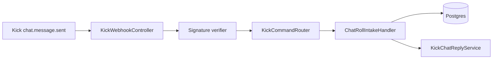

# Kick Chat Bot — Architecture Spine

## Paradigm

Event-driven webhook intake with session-scoped command matching. One ingress, many tenants — route by `broadcaster.user_id` → `account_channels` → live `chat_roll`.

## AD-1 — Single webhook ingress

- **Binds:** `POST /webhooks/kick` only; Kick Developer portal registers one URL.
- **Prevents:** Per-account webhook URLs or channel-specific endpoints.
- **Rule:** Verify `Kick-Event-Signature` on raw body; dedupe via `kick_chat_events.message_id`.

## AD-2 — Keyword command model

- **Binds:** One `chat_roll.keyword` per session; match `content.trim()` case-insensitively.
- **Prevents:** Prefix parsers, multi-command DSL, args in MVP.
- **Rule:** Mismatch → no-op (no chat reply).

## AD-3 — Session flags

- **Binds:** `is_accepting_participants` gates inserts; `reply_in_chat` gates bot confirmation only.
- **Prevents:** Reply when entries paused or on duplicate join.
- **Rule:** Reply only after successful participant insert when `reply_in_chat = true`.

## AD-4 — Dev transport

- **Binds:** `KICK_CHAT_MOCK=true` → `POST /dev/kick/chat` + skip signature.
- **Prevents:** ngrok as required dev tool.
- **Rule:** Production uses Cloudflare Tunnel or deployed HTTPS URL matching Kick portal.

## Component map

## Deferred

- Pusher WebSocket fallback
- Per-session reply message template
- Chat Roll REST API sync with dashboard UI
