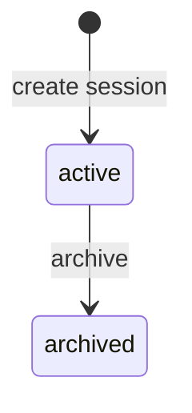

# Prize Spin — session status (`prize_spin.status`)

Two-state lifecycle for prize spin sessions.

| `status` | UI label | Meaning |
|----------|----------|---------|
| `active` | **Active** | Default; editable; public overlay at `/modules/prize-spin/{id}/widget` serves this session |
| `archived` | **Archived** | Read-only workspace; hidden from **Active** history filter; overlay returns **Session not found.** |

**Default for new sessions:** `active`.

**Removed:** `live`, `off_air`, go-live/deactivate, singleton live index, and **Live** / **Off air** chips.

## Transitions

**Archive:** `active` → `archived` (one `UPDATE`; idempotent reject if already archived or missing).

## Database

| Column | Contract |
|--------|----------|
| `status` | `TEXT NOT NULL DEFAULT 'active' CHECK (status IN ('active', 'archived'))` |

Index `idx_prize_spin_account_created` on `(account_id, created_at DESC) WHERE status = 'active'`.

## API

`PrizeSpinRecord.status`: `'active' | 'archived'`.

**List filter** (`archived` query param):

| Value | SQL |
|-------|-----|
| `false` (default) | `status = 'active'` |
| `true` | `status = 'archived'` |
| `all` | no status filter |

**Mutations** (spin, sector/win CRUD, widget settings): reject with `404` when parent `status = 'archived'`.

**Public widget:** `GET /prize-spins/:id/widget` when `status = 'active'`; archived → `404`.

## UI

| Location | `active` | `archived` |
|----------|----------|------------|
| History status chip | **Active** | **Archived** |
| History actions | Archive, Open | Open only (Archive disabled) |
| Session workspace | full edit | **Archived** chip; read-only — controls visible, disabled |
