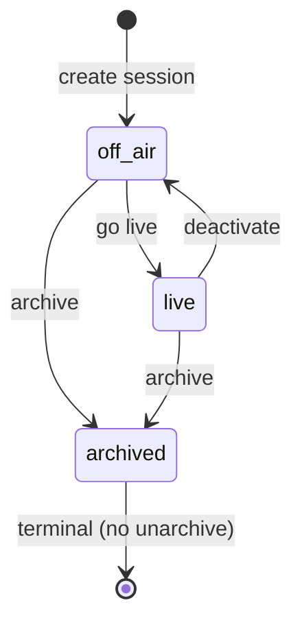

# Prize Spin — session status (`prize_spin.status`)

Replaces separate `is_active` and `is_archived` booleans with one enum column. Eliminates the invalid `is_active=true AND is_archived=true` combination and makes transitions explicit.

## Enum values

| DB / API value | UI label | Meaning |
|----------------|----------|---------|
| `live` | **Live** | On stream overlay; at most one per account; fully editable |
| `off_air` | **Off air** | In History, fully editable; not on overlay |
| `archived` | **Archived** | Read-only in dashboard; not on overlay; mutations blocked |

**Default for new sessions:** `off_air`.

**Why not `active` as a status value:** History filter **Active** already means “non-archived” (`live` + `off_air`). The old `is_active` column meant live-on-air, not “session exists”. Using `active` in the enum would collide with both.

**Why `off_air` for the third state:** Matches existing operator copy in the stream widget spec (**Live** / **Off air** chips). Alternatives considered: `idle` (accurate but less domain-specific), `inactive` (confusable with archived), `draft` (implies incomplete setup).

## State machine

**Go live:** in one transaction, set prior `live` row on same account → `off_air`, then target → `live`. Rejects when target is `archived`.

**Deactivate:** `live` → `off_air` (idempotent if already `off_air`).

**Archive:** `live` or `off_air` → `archived`. No separate deactivate step when archiving a live session.

## Schema

Replace on `prize_spin`:

| Remove | Replace with |
|--------|--------------|
| `is_active BOOLEAN` | `status TEXT NOT NULL DEFAULT 'off_air' CHECK (status IN ('live', 'off_air', 'archived'))` |
| `is_archived BOOLEAN` | ( absorbed into `status` ) |

**Indexes:**

- Partial unique: `(account_id) WHERE status = 'live'` — singleton live session
- Partial list: `(account_id, created_at DESC) WHERE status != 'archived'` — active History queries

## API surface

`PrizeSpinRecord.status`: `'live' | 'off_air' | 'archived'`.

**Derived helpers (client, optional during transition):**

- `isLive` → `status === 'live'`
- `isArchived` → `status === 'archived'`
- `readOnly` → `status === 'archived'`

**List filter** (`archived` query param — unchanged labels):

| Param | SQL filter |
|-------|------------|
| `false` (default) | `status IN ('live', 'off_air')` |
| `true` | `status = 'archived'` |
| `all` | no status filter |

**Get session / sectors / wins:** allowed for all statuses including `archived`.

**Mutations** (go live, deactivate, spin, sector/win CRUD, title, widget): reject with `404` when parent `status = 'archived'`.

**Public widget:** resolve row where `account_id` matches and `status = 'live'`.

**Go live / deactivate:** transition `off_air` ↔ `live`; reject when `status = 'archived'`.

## UI mapping

| Location | `live` | `off_air` | `archived` |
|----------|--------|-----------|------------|
| History Status chip | **Live** (success) | none | **Archived** (muted) |
| History row border | orange inset | default | muted title |
| History actions | Deactivate, Archive, Open | Go live, Archive, Open | Open enabled; others visible, disabled |
| Session workspace | **Live** chip + Deactivate; full edit | Go live; full edit | **Archived** chip; read-only — controls visible, disabled |
| History filter **Active** | includes | includes | excludes |

## Cross-spec impact

Adopted companions that reference `is_active` / `is_archived` on `prize_spin` (`live-session-control.md`, stream widget SPEC, session page SPEC) follow this enum on implement — archived sessions become read-only workspace, not 404.
